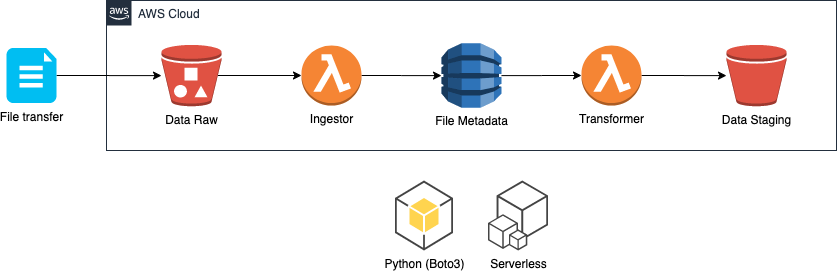

# Simple ETL on AWS powered by Serverless, Lambda and Python

This repository contains a simple ETL process delivered for the DNX mentoring program. The following topics are contained in this project:

- AWS
    - Lambda
    - CloudFormation
    - DynamoDB
    - S3
    - CloudWatch
- Serverless framework
- Python
    - Python OO
    - Boto3 (AWS SDK)

## Architecture



## Serverless Quick Start Guide

Tutorial available on `https://www.serverless.com/framework/docs/providers/aws/guide/quick-start/`.

## Serverless plugin installation and Python dependencies fix

To make use of Python common libs install the plugin `serverless-python-requirements`. To install the plugin execute the command:

```
serverless plugin install --name <pluginName>
```

1. `serverless-python-requirements`

```
serverless plugin install --name serverless-python-requirements
```

Additional details about plugins installation in `https://www.serverless.com/framework/docs/providers/aws/cli-reference/plugin-install/`.

## Serverless tests (local and remote)

To perform tests Serverless use the command `serverless invoke` or `sls invoke`. 

Important notes:
- For local tests include the statement `local` after the command `invoke`.
- Specify the function name with `-f <functionName>`.
- If your function expect parameters create a file and specify with `-p <parameters.json>`.

```
sls invoke [local] -f <myFunction> -p <myEventData.json>
```

1. `Ingestor` (local)

```
sls invoke local -f ingestor -p test/lambda/s3-raw-stub.json
```

2. `Transformer` (local)

```
sls invoke local -f transformer -p test/lambda/dynamo-stub.json
```